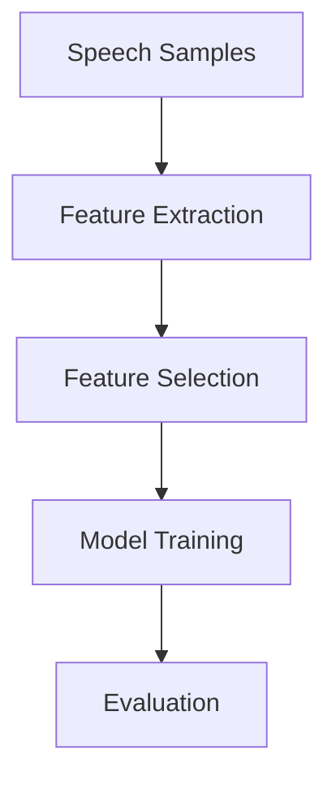

# Parkinson's Disease Detection from Speech Features


## Table of Contents
- [Project Overview](#project-overview)
- [Current Status](#current-status)
- [Dataset](#dataset)
- [Methodology](#methodology)
- [Usage](#usage)
- [Model Performance](#model-performance)
- [Future Work](#future-work)
- [Contributing](#contributing)
- [License](#license)

## Project Overview

This research project develops machine learning models for early detection of Parkinson's Disease through speech analysis. The system analyzes vocal features extracted from speech recordings to identify patterns indicative of Parkinsonian symptoms. 

**Key Features:**
- Machine learning pipeline for speech-based diagnosis
- Support for multiple languages (currently English, expanding to Arabic)
- Comprehensive model evaluation framework
- Clinical interpretation tools

## Current Status

🚧 **Active Research Project** 🚧

This project is under active development as part of ongoing research. Current focus areas include:
- Exploring machine learning approaches (SVM, XGboost, RandomForest, etc...)
- Exploring deep learning approaches (CNNs, Transformers) for raw audio processing
- Collecting and analyzing Arabic speech datasets
- Investigating cross-linguistic symptom manifestations
- Developing more robust feature extraction pipelines

## Dataset

### Currently Used Datasets
- **English Speech Data**: https://www.kaggle.com/datasets/vikasukani/parkinsons-disease-data-set/data
  - 195 samples from Parkinson's patients and healthy controls
  - 23 acoustic features per sample
  - Publicly available dataset from UCI Machine Learning Repository

### Upcoming Expansions
- **Arabic Speech Data** (Collection in Progress):
  - Collaborating with neurology clinics in Tunisia
  - Developing Arabic-specific feature extraction
  - Addressing dialectal variations

## Methodology

### Current Implementation


**Feature Pipeline:**
1. Acoustic parameter extraction (MDVP, jitter, shimmer)
2. Nonlinear dynamics measures (DFA, RPDE)
3. Feature scaling and normalization

**Models Implemented:**
- SVM (Current best performer)

### Research Directions
- Developing end-to-end deep learning models
- Multilingual feature representations
- Longitudinal symptom tracking

## Installation

### Requirements
- Python 3.8+
- pip package manager

### Required Packages
```text
numpy>=1.21.0
pandas>=1.3.0
scikit-learn>=1.0.0
matplotlib>=3.5.0
seaborn>=0.11.0
imbalanced-learn>=0.8.0
jupyter>=1.0.0
librosa>=0.9.0  # For future audio processing
```

## Usage

### Running Analysis
1. Start with exploratory data analysis:
```bash
jupyter notebook Exploratory_Data_Analysis.ipynb
```

2. Proceed to model development:
```bash
jupyter notebook SVM.ipynb
```


## Model Performance

### Current Best Model (SVM)
| Metric          | Score  |
|-----------------|--------|
| Accuracy        | 92.3%  |
| ROC AUC         | 0.972  |
| Sensitivity     | 93%    |
| Specificity     | 90%    |
| F1 Score        | 0.947  |


## Future Work

### Short-Term Goals
- [ ] Explore other ML Models (XGBoost, RandomForest, etc...)
- [ ] Implement LSTM networks for sequential pattern detection
- [ ] Complete Arabic dataset collection

### Long-Term Objectives
- [ ] Mobile application for symptom monitoring

## Contributing

We welcome contributions to this research project! Please see our [Contribution Guidelines](CONTRIBUTING.md) for details.

Current research collaborations:
- Neurology Department at Habib Bourguiba Hospital

## License

This project is licensed under the MIT License - see the [LICENSE](LICENSE) file for details.

**Important Note:** This software is for research purposes only and not approved for clinical use. Always consult qualified medical professionals for diagnosis.
